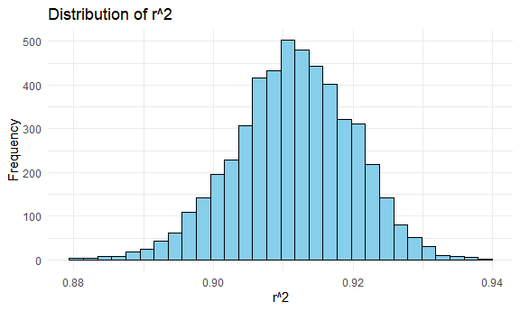
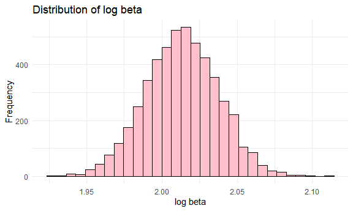
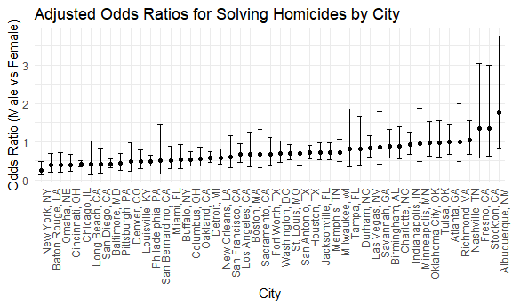
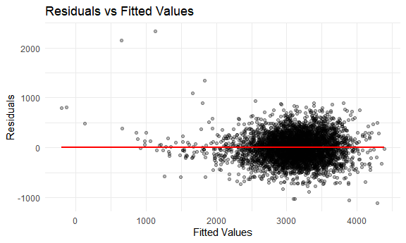
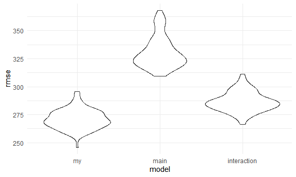

p8105_hw6_hp2661
================
Huizhong Peng
2024-12-02

### Problem 1

``` r
weather_df = 
  rnoaa::meteo_pull_monitors(
    c("USW00094728"),
    var = c("PRCP", "TMIN", "TMAX"), 
    date_min = "2017-01-01",
    date_max = "2017-12-31") %>%
  mutate(
    name = recode(id, USW00094728 = "CentralPark_NY"),
    tmin = tmin / 10,
    tmax = tmax / 10) %>%
  select(name, id, everything())

boot_sample = function(df) {
  sample_frac(df, replace = TRUE)
}

quantity = function(model) {
  r_sq = broom::glance(model)$r.squared
  beta_0 = broom::tidy(model) |> filter(term == "(Intercept)") |> pull(estimate)
  beta_1 = broom::tidy(model) |> filter(term == "tmin") |> pull(estimate)
  log_beta = log(abs(beta_0*beta_1))
  
  tibble(r_squared = r_sq, log_beta)
}

boot_straps = 
  tibble(strap_number = 1:5000) |> 
  mutate(
    strap_sample = map(strap_number, \(i) boot_sample(df = weather_df))
  )

bootstrap_results = 
  boot_straps |> 
  mutate(
    models = map(strap_sample, \(df) lm(tmax ~ tmin, data = df)),
    results = map(models, quantity)
  ) |> 
  select(-strap_sample, -models) |> 
  unnest(results) 

# plot
bootstrap_results |> 
  ggplot(aes(x = r_squared)) +
  geom_histogram(fill = "skyblue", color = "black") +
  labs(title = "Distribution of r^2", x = "r^2", y = "Frequency")
```



``` r

bootstrap_results |> 
  ggplot(aes(x = log_beta)) +
  geom_histogram(fill = "pink", color = "black") +
  labs(title = "Distribution of log beta", x = "log beta", y = "Frequency")
```



These quantities are normal distributed.

### Problem 2

Baltimore:

``` r
url = "https://raw.githubusercontent.com/washingtonpost/data-homicides/refs/heads/master/homicide-data.csv"
raw_dat = read_csv(url, na = c("Unknown", ""))

write.csv(raw_dat, "data/homicide_raw_data.csv", row.names = FALSE)

# data cleaning
dat = raw_dat |> 
  janitor::clean_names() |> 
  mutate(
    city_state = paste(city, state, sep = ", "),
    resolved = ifelse(disposition == "Closed by arrest", 1, 0),
    victim_age = as.numeric(victim_age)
  ) |> 
  filter(!city_state %in% c("Dallas, TX", "Phoenix, AZ", "Kansas City, MO", "Tulsa, AL")) |> 
  filter(victim_race %in% c("White", "Black"))

bal = dat |> 
  filter(city_state == "Baltimore, MD") |> 
  select(uid, resolved, victim_age, victim_sex, victim_race)

# glm
bal_fit_log = bal |> 
  glm(resolved ~ victim_age + victim_sex + victim_race, 
      data = _, family = binomial())

bal_fit_log |> 
  broom::tidy() |> 
  knitr::kable(digits = 3)
```

| term             | estimate | std.error | statistic | p.value |
|:-----------------|---------:|----------:|----------:|--------:|
| (Intercept)      |    0.310 |     0.171 |     1.810 |   0.070 |
| victim_age       |   -0.007 |     0.003 |    -2.024 |   0.043 |
| victim_sexMale   |   -0.854 |     0.138 |    -6.184 |   0.000 |
| victim_raceWhite |    0.842 |     0.175 |     4.818 |   0.000 |

``` r

bal_sex_OR = 
  bal_fit_log |>
  broom::tidy(conf.int = TRUE, exponentiate = TRUE) |> 
  select(term, OR = estimate, std = std.error, 
         ci_low = conf.low, ci_high = conf.high) |> 
  filter(term == "victim_sexMale") |> 
  knitr::kable(digits = 3)

bal_sex_OR
```

| term           |    OR |   std | ci_low | ci_high |
|:---------------|------:|------:|-------:|--------:|
| victim_sexMale | 0.426 | 0.138 |  0.324 |   0.558 |

All cities:

``` r
fit_log = function(data){
  model = glm(resolved ~ victim_age + victim_sex + victim_race, 
              data = data, family = binomial())
  
  model |> 
    broom::tidy(conf.int = TRUE, exponentiate = TRUE) |> 
    select(term, OR = estimate, std = std.error, 
           ci_low = conf.low, ci_high = conf.high) |> 
    filter(term == "victim_sexMale")
}

dat_nest = dat |> 
  group_by(city_state) |> 
  nest() 

all_sex_OR = 
  dat_nest |> 
  mutate(
    model = map(data, fit_log)
  ) |> 
  unnest(model) |> 
  select(city_state, OR, std, ci_low, ci_high) |> 
  tibble()

all_sex_OR |> 
  knitr::kable(digits = 3)
```

| city_state         |    OR |   std | ci_low | ci_high |
|:-------------------|------:|------:|-------:|--------:|
| Albuquerque, NM    | 1.767 | 0.385 |  0.825 |   3.762 |
| Atlanta, GA        | 1.000 | 0.194 |  0.680 |   1.458 |
| Baltimore, MD      | 0.426 | 0.138 |  0.324 |   0.558 |
| Baton Rouge, LA    | 0.381 | 0.306 |  0.204 |   0.684 |
| Birmingham, AL     | 0.870 | 0.212 |  0.571 |   1.314 |
| Boston, MA         | 0.667 | 0.324 |  0.351 |   1.260 |
| Buffalo, NY        | 0.521 | 0.299 |  0.288 |   0.936 |
| Charlotte, NC      | 0.884 | 0.236 |  0.551 |   1.391 |
| Chicago, IL        | 0.410 | 0.102 |  0.336 |   0.501 |
| Cincinnati, OH     | 0.400 | 0.269 |  0.231 |   0.667 |
| Columbus, OH       | 0.532 | 0.174 |  0.377 |   0.748 |
| Denver, CO         | 0.479 | 0.360 |  0.233 |   0.962 |
| Detroit, MI        | 0.582 | 0.118 |  0.462 |   0.734 |
| Durham, NC         | 0.812 | 0.372 |  0.382 |   1.658 |
| Fort Worth, TX     | 0.669 | 0.266 |  0.394 |   1.121 |
| Fresno, CA         | 1.335 | 0.425 |  0.567 |   3.048 |
| Houston, TX        | 0.711 | 0.124 |  0.557 |   0.906 |
| Indianapolis, IN   | 0.919 | 0.154 |  0.678 |   1.241 |
| Jacksonville, FL   | 0.720 | 0.150 |  0.536 |   0.965 |
| Las Vegas, NV      | 0.837 | 0.164 |  0.606 |   1.151 |
| Long Beach, CA     | 0.410 | 0.495 |  0.143 |   1.024 |
| Los Angeles, CA    | 0.662 | 0.188 |  0.457 |   0.954 |
| Louisville, KY     | 0.491 | 0.243 |  0.301 |   0.784 |
| Memphis, TN        | 0.723 | 0.159 |  0.526 |   0.984 |
| Miami, FL          | 0.515 | 0.268 |  0.304 |   0.873 |
| Milwaukee, wI      | 0.727 | 0.192 |  0.495 |   1.054 |
| Minneapolis, MN    | 0.947 | 0.348 |  0.476 |   1.881 |
| Nashville, TN      | 1.034 | 0.210 |  0.681 |   1.556 |
| New Orleans, LA    | 0.585 | 0.167 |  0.422 |   0.812 |
| New York, NY       | 0.262 | 0.328 |  0.133 |   0.485 |
| Oakland, CA        | 0.563 | 0.221 |  0.364 |   0.867 |
| Oklahoma City, OK  | 0.974 | 0.227 |  0.623 |   1.520 |
| Omaha, NE          | 0.382 | 0.323 |  0.199 |   0.711 |
| Philadelphia, PA   | 0.496 | 0.139 |  0.376 |   0.650 |
| Pittsburgh, PA     | 0.431 | 0.248 |  0.263 |   0.696 |
| Richmond, VA       | 1.006 | 0.359 |  0.483 |   1.994 |
| San Antonio, TX    | 0.705 | 0.292 |  0.393 |   1.238 |
| Sacramento, CA     | 0.669 | 0.353 |  0.326 |   1.314 |
| Savannah, GA       | 0.867 | 0.367 |  0.419 |   1.780 |
| San Bernardino, CA | 0.500 | 0.547 |  0.166 |   1.462 |
| San Diego, CA      | 0.413 | 0.371 |  0.191 |   0.830 |
| San Francisco, CA  | 0.608 | 0.332 |  0.312 |   1.155 |
| St. Louis, MO      | 0.703 | 0.144 |  0.530 |   0.932 |
| Stockton, CA       | 1.352 | 0.397 |  0.626 |   2.994 |
| Tampa, FL          | 0.808 | 0.430 |  0.340 |   1.860 |
| Tulsa, OK          | 0.976 | 0.237 |  0.609 |   1.544 |
| Washington, DC     | 0.691 | 0.198 |  0.466 |   1.014 |

Plot:

``` r
all_sex_OR |> 
  mutate(
    city_state = fct_reorder(city_state, OR)
  ) |> 
  ggplot(aes(x = city_state, y = OR)) +
  geom_point() +
  geom_errorbar(aes(ymin = ci_low, ymax = ci_high), width = 0.5) +
  labs(
    title = "Adjusted Odds Ratios for Solving Homicides by City",
    x = "City",
    y = "Odds Ratio (Male vs Female)"
  ) +
  theme(
    axis.text.x = element_text(angle = 90, hjust = 1)
  )
```



Adjusted odds Ratios in most cities are less than 1, showing that there
are more female victims than male victims keeping all other variables
fixed.

New York City has the lowest adjusted OR and Albuquerque City has the
highest adjusted OR.

### Problem 3

``` r
bwt_df = 
  read_csv("data/birthweight.csv", 
           col_types = cols(
             babysex = "c", frace = "c", malform = "c", mrace = "c"))

skimr::skim(bwt_df)
```

|                                                  |        |
|:-------------------------------------------------|:-------|
| Name                                             | bwt_df |
| Number of rows                                   | 4342   |
| Number of columns                                | 20     |
| \_\_\_\_\_\_\_\_\_\_\_\_\_\_\_\_\_\_\_\_\_\_\_   |        |
| Column type frequency:                           |        |
| character                                        | 4      |
| numeric                                          | 16     |
| \_\_\_\_\_\_\_\_\_\_\_\_\_\_\_\_\_\_\_\_\_\_\_\_ |        |
| Group variables                                  | None   |

Data summary

**Variable type: character**

| skim_variable | n_missing | complete_rate | min | max | empty | n_unique | whitespace |
|:--------------|----------:|--------------:|----:|----:|------:|---------:|-----------:|
| babysex       |         0 |             1 |   1 |   1 |     0 |        2 |          0 |
| frace         |         0 |             1 |   1 |   1 |     0 |        5 |          0 |
| malform       |         0 |             1 |   1 |   1 |     0 |        2 |          0 |
| mrace         |         0 |             1 |   1 |   1 |     0 |        4 |          0 |

**Variable type: numeric**

| skim_variable | n_missing | complete_rate |    mean |     sd |     p0 |     p25 |     p50 |     p75 |   p100 | hist  |
|:--------------|----------:|--------------:|--------:|-------:|-------:|--------:|--------:|--------:|-------:|:------|
| bhead         |         0 |             1 |   33.65 |   1.62 |  21.00 |   33.00 |   34.00 |   35.00 |   41.0 | ▁▁▆▇▁ |
| blength       |         0 |             1 |   49.75 |   2.72 |  20.00 |   48.00 |   50.00 |   51.00 |   63.0 | ▁▁▁▇▁ |
| bwt           |         0 |             1 | 3114.40 | 512.15 | 595.00 | 2807.00 | 3132.50 | 3459.00 | 4791.0 | ▁▁▇▇▁ |
| delwt         |         0 |             1 |  145.57 |  22.21 |  86.00 |  131.00 |  143.00 |  157.00 |  334.0 | ▅▇▁▁▁ |
| fincome       |         0 |             1 |   44.11 |  25.98 |   0.00 |   25.00 |   35.00 |   65.00 |   96.0 | ▃▇▅▂▃ |
| gaweeks       |         0 |             1 |   39.43 |   3.15 |  17.70 |   38.30 |   39.90 |   41.10 |   51.3 | ▁▁▂▇▁ |
| menarche      |         0 |             1 |   12.51 |   1.48 |   0.00 |   12.00 |   12.00 |   13.00 |   19.0 | ▁▁▂▇▁ |
| mheight       |         0 |             1 |   63.49 |   2.66 |  48.00 |   62.00 |   63.00 |   65.00 |   77.0 | ▁▁▇▂▁ |
| momage        |         0 |             1 |   20.30 |   3.88 |  12.00 |   18.00 |   20.00 |   22.00 |   44.0 | ▅▇▂▁▁ |
| parity        |         0 |             1 |    0.00 |   0.10 |   0.00 |    0.00 |    0.00 |    0.00 |    6.0 | ▇▁▁▁▁ |
| pnumlbw       |         0 |             1 |    0.00 |   0.00 |   0.00 |    0.00 |    0.00 |    0.00 |    0.0 | ▁▁▇▁▁ |
| pnumsga       |         0 |             1 |    0.00 |   0.00 |   0.00 |    0.00 |    0.00 |    0.00 |    0.0 | ▁▁▇▁▁ |
| ppbmi         |         0 |             1 |   21.57 |   3.18 |  13.07 |   19.53 |   21.03 |   22.91 |   46.1 | ▃▇▁▁▁ |
| ppwt          |         0 |             1 |  123.49 |  20.16 |  70.00 |  110.00 |  120.00 |  134.00 |  287.0 | ▅▇▁▁▁ |
| smoken        |         0 |             1 |    4.15 |   7.41 |   0.00 |    0.00 |    0.00 |    5.00 |   60.0 | ▇▁▁▁▁ |
| wtgain        |         0 |             1 |   22.08 |  10.94 | -46.00 |   15.00 |   22.00 |   28.00 |   89.0 | ▁▁▇▁▁ |

``` r

model = lm(bwt ~ bhead + blength + babysex + delwt + fincome + frace + gaweeks + malform + mrace + ppbmi + ppwt + smoken + wtgain, 
         data = bwt_df)
summary(model)
## 
## Call:
## lm(formula = bwt ~ bhead + blength + babysex + delwt + fincome + 
##     frace + gaweeks + malform + mrace + ppbmi + ppwt + smoken + 
##     wtgain, data = bwt_df)
## 
## Residuals:
##      Min       1Q   Median       3Q      Max 
## -1092.29  -184.83    -4.13   174.54  2352.71 
## 
## Coefficients: (1 not defined because of singularities)
##               Estimate Std. Error t value             Pr(>|t|)    
## (Intercept) -5674.9714   101.4416 -55.943 < 0.0000000000000002 ***
## bhead         130.9730     3.4511  37.951 < 0.0000000000000002 ***
## blength        74.9525     2.0214  37.080 < 0.0000000000000002 ***
## babysex2       29.1541     8.4621   3.445             0.000576 ***
## delwt           4.1282     0.3927  10.511 < 0.0000000000000002 ***
## fincome         0.3142     0.1752   1.793             0.073045 .  
## frace2         12.8513    46.1466   0.278             0.780651    
## frace3         20.4833    69.2896   0.296             0.767535    
## frace4        -49.4337    44.6733  -1.107             0.268545    
## frace8          3.4112    74.0939   0.046             0.963282    
## gaweeks        11.2966     1.4592   7.742   0.0000000000000121 ***
## malform1       10.1922    70.6399   0.144             0.885283    
## mrace2       -151.9035    46.0370  -3.300             0.000976 ***
## mrace3        -93.2657    71.8164  -1.299             0.194127    
## mrace4        -57.4504    45.1263  -1.273             0.203051    
## ppbmi          -9.1366     2.5807  -3.540             0.000404 ***
## ppwt           -1.1025     0.5685  -1.939             0.052533 .  
## smoken         -4.8791     0.5872  -8.309 < 0.0000000000000002 ***
## wtgain              NA         NA      NA                   NA    
## ---
## Signif. codes:  0 '***' 0.001 '**' 0.01 '*' 0.05 '.' 0.1 ' ' 1
## 
## Residual standard error: 272.6 on 4324 degrees of freedom
## Multiple R-squared:  0.7178, Adjusted R-squared:  0.7167 
## F-statistic: 646.9 on 17 and 4324 DF,  p-value: < 0.00000000000000022
```

Remain significant variables (e.g., `bhead`, `blength`, `babysex`) in
final regression model.

``` r
final_model = lm(bwt ~ bhead + blength + babysex + delwt + gaweeks + mrace + ppbmi + smoken,
              data = bwt_df)
summary(final_model)
## 
## Call:
## lm(formula = bwt ~ bhead + blength + babysex + delwt + gaweeks + 
##     mrace + ppbmi + smoken, data = bwt_df)
## 
## Residuals:
##      Min       1Q   Median       3Q      Max 
## -1108.51  -182.60    -4.38   176.49  2330.33 
## 
## Coefficients:
##               Estimate Std. Error t value             Pr(>|t|)    
## (Intercept) -5660.2709   101.1068 -55.983 < 0.0000000000000002 ***
## bhead         131.4151     3.4459  38.136 < 0.0000000000000002 ***
## blength        74.7141     2.0190  37.006 < 0.0000000000000002 ***
## babysex2       28.4315     8.4566   3.362              0.00078 ***
## delwt           3.6250     0.2844  12.747 < 0.0000000000000002 ***
## gaweeks        11.5615     1.4556   7.943   0.0000000000000025 ***
## mrace2       -144.5198     9.2110 -15.690 < 0.0000000000000002 ***
## mrace3        -77.6223    42.3093  -1.835              0.06663 .  
## mrace4       -102.6952    18.8704  -5.442   0.0000000555538029 ***
## ppbmi         -12.5945     1.9171  -6.570   0.0000000000563661 ***
## smoken         -4.8843     0.5860  -8.335 < 0.0000000000000002 ***
## ---
## Signif. codes:  0 '***' 0.001 '**' 0.01 '*' 0.05 '.' 0.1 ' ' 1
## 
## Residual standard error: 272.6 on 4331 degrees of freedom
## Multiple R-squared:  0.7173, Adjusted R-squared:  0.7166 
## F-statistic:  1099 on 10 and 4331 DF,  p-value: < 0.00000000000000022

bwt_df = bwt_df |> 
  add_predictions(final_model) |> 
  add_residuals(final_model)

# plot
bwt_df |> 
  ggplot(aes(x = pred, y = resid)) +
  geom_point(alpha = .3) +
  geom_smooth(method = "lm", se = FALSE, color = "red") +
  labs(
    title = "Residuals vs Fitted Values",
    x = "Fitted Values",
    y = "Residuals"
  )
```



Compare this model to other models:

``` r
model1 = lm(bwt ~ blength + gaweeks,
            data = bwt_df)
summary(model1)
## 
## Call:
## lm(formula = bwt ~ blength + gaweeks, data = bwt_df)
## 
## Residuals:
##     Min      1Q  Median      3Q     Max 
## -1709.6  -215.4   -11.4   208.2  4188.8 
## 
## Coefficients:
##              Estimate Std. Error t value            Pr(>|t|)    
## (Intercept) -4347.667     97.958  -44.38 <0.0000000000000002 ***
## blength       128.556      1.990   64.60 <0.0000000000000002 ***
## gaweeks        27.047      1.718   15.74 <0.0000000000000002 ***
## ---
## Signif. codes:  0 '***' 0.001 '**' 0.01 '*' 0.05 '.' 0.1 ' ' 1
## 
## Residual standard error: 333.2 on 4339 degrees of freedom
## Multiple R-squared:  0.5769, Adjusted R-squared:  0.5767 
## F-statistic:  2958 on 2 and 4339 DF,  p-value: < 0.00000000000000022
model2 = lm(bwt ~ bhead + blength + babysex + bhead*blength + bhead*babysex + blength*babysex + bhead*blength*babysex,
            data = bwt_df)
summary(model2)
## 
## Call:
## lm(formula = bwt ~ bhead + blength + babysex + bhead * blength + 
##     bhead * babysex + blength * babysex + bhead * blength * babysex, 
##     data = bwt_df)
## 
## Residuals:
##      Min       1Q   Median       3Q      Max 
## -1132.99  -190.42   -10.33   178.63  2617.96 
## 
## Coefficients:
##                          Estimate Std. Error t value     Pr(>|t|)    
## (Intercept)            -7176.8170  1264.8397  -5.674 0.0000000149 ***
## bhead                    181.7956    38.0542   4.777 0.0000018356 ***
## blength                  102.1269    26.2118   3.896 0.0000991804 ***
## babysex2                6374.8684  1677.7669   3.800     0.000147 ***
## bhead:blength             -0.5536     0.7802  -0.710     0.478012    
## bhead:babysex2          -198.3932    51.0917  -3.883     0.000105 ***
## blength:babysex2        -123.7729    35.1185  -3.524     0.000429 ***
## bhead:blength:babysex2     3.8781     1.0566   3.670     0.000245 ***
## ---
## Signif. codes:  0 '***' 0.001 '**' 0.01 '*' 0.05 '.' 0.1 ' ' 1
## 
## Residual standard error: 287.7 on 4334 degrees of freedom
## Multiple R-squared:  0.6849, Adjusted R-squared:  0.6844 
## F-statistic:  1346 on 7 and 4334 DF,  p-value: < 0.00000000000000022

cv_df = 
  crossv_mc(bwt_df, 100) |> 
  mutate(
    train = map(train, as_tibble),
    test = map(test, as_tibble)
  )

cv_df = 
  cv_df |> 
  mutate(
    mod_f = map(train, \(df) final_model),
    mod_1 = map(train, \(df) model1),
    mod_2 = map(train, \(df) model2)) |> 
  mutate(
    rmse_my = map2_dbl(mod_f, test, \(mod, df) rmse(model = mod, data = df)),
    rmse_main = map2_dbl(mod_1, test, \(mod, df) rmse(model = mod, data = df)),
    rmse_interaction = map2_dbl(mod_2, test, \(mod, df) rmse(model = mod, data = df)))

cv_df |> 
  select(starts_with("rmse")) |> 
  pivot_longer(
    everything(),
    names_to = "model", 
    values_to = "rmse",
    names_prefix = "rmse_") |> 
  mutate(model = fct_inorder(model)) |> 
  ggplot(aes(x = model, y = rmse)) + geom_violin()
```



The model containing `bhead`, `blength`, `babysex`, `delwt`, `gaweeks`,
`mrace`, `ppbmi` and `smoken` has the lowest rmse.
